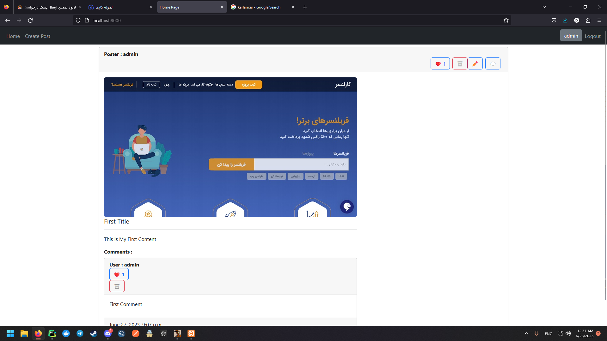
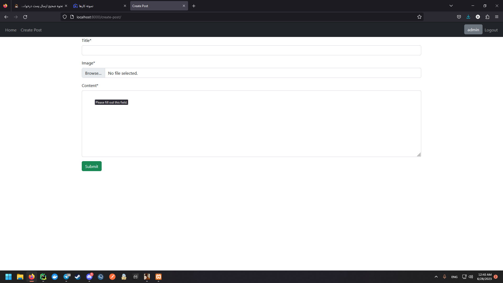
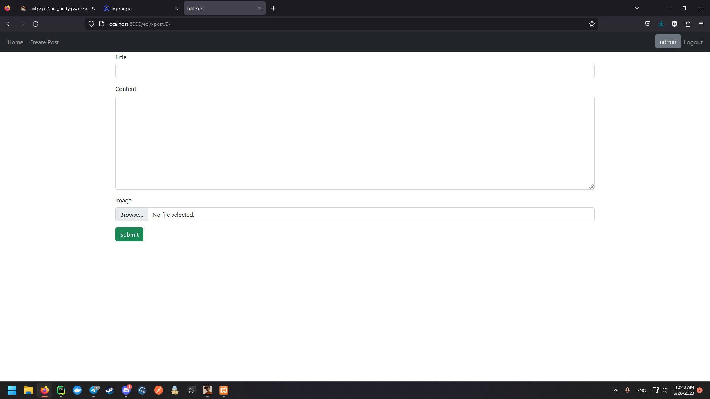
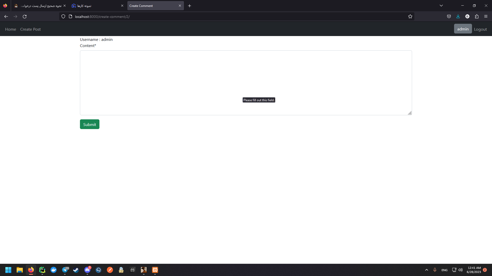
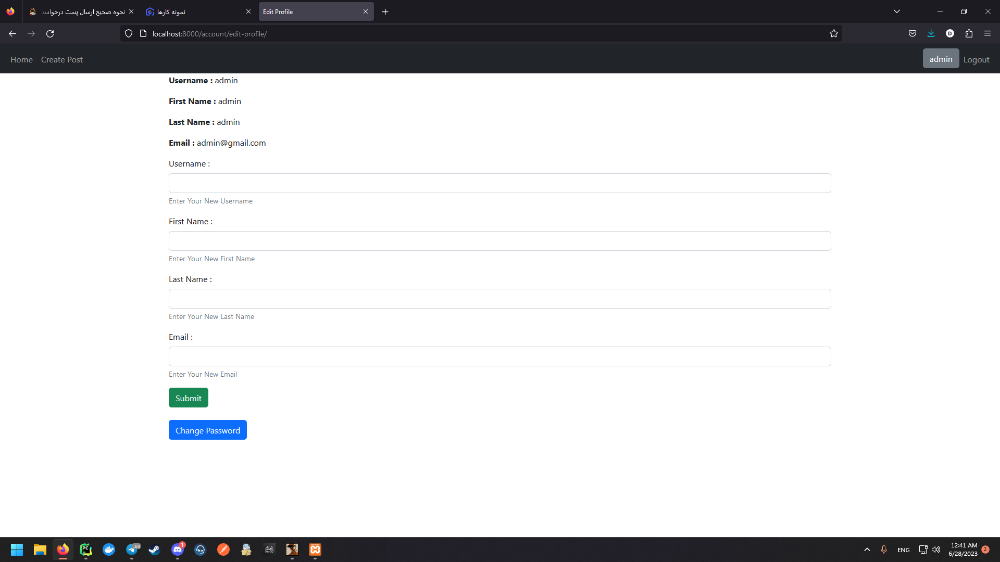

# Weblog Project

## Description
This project is a weblog application that allows users to create and publish blog posts.
Remember that this project is designed to be simple and easy to use with simply only CRUD operations.

## Features
- User authentication
- Create, edit, and delete blog posts
- View and comment on other users posts
- Responsive design for mobile and desktop

## Installation
1. Clone the repository
2. Install dependencies with `pip install -r requirements.txt`
3. Set up the database (mysql, you'll need xampp for windows)
4. Start the server with `python manage.py runserver`

## Technologies Used
- python
- django
- mysql
- html/css
- bootstrap

## Contributing
1. Fork the repository
2. Create a new branch for your feature or bug fix
3. Make your changes
4. Submit a pull request

## View Project
- Home Page

- Create Post

- Edit Post

- Write Comment

- Edit Profile
